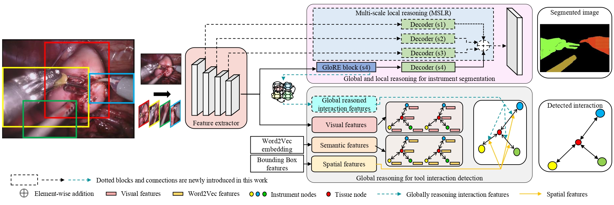
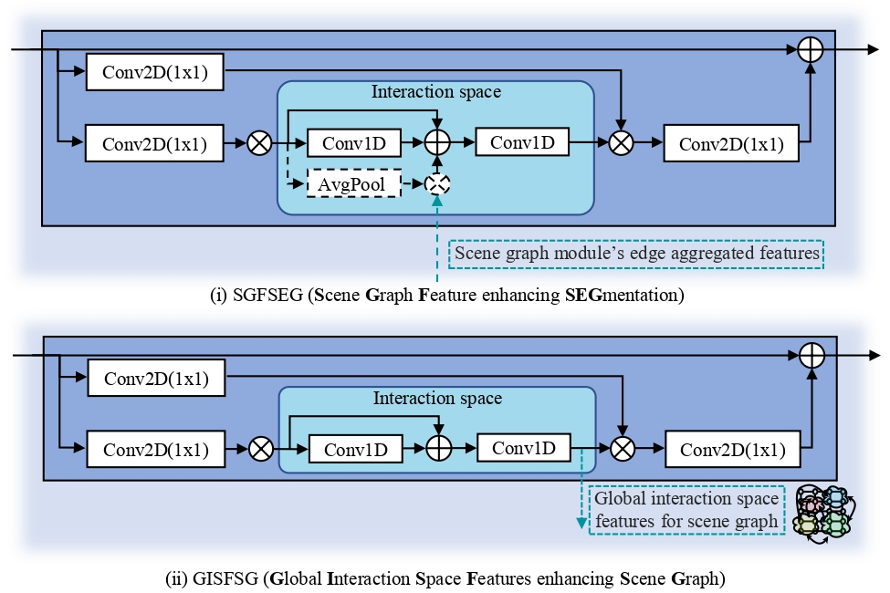

<div align="center">

<samp>

<h2> Global-Reasoned Multi-Task Model for Surgical Scene Understanding </h1>

<h4> Seenivasan lalithkumar, Sai Mitheran, Mobarakol Islam, Hongliang Ren </h3>

</samp>   

---
| **[ [```arXiv```](<https://arxiv.org/abs/2201.11957>) ]** |**[ [```Paper```](<https://ieeexplore.ieee.org/document/9695281>) ]** |**[ [```YouTube```](<https://youtu.be/UOIcp3y4o1U>) ]** |
|:-------------------:|:-------------------:|:-------------------:|
    
ICRA 2022, IEEE Robotics and Automation Letters (RA-L)
---

</div>     
    
---

If you find our code or paper useful, please cite as

```bibtex
@article{seenivasan2022global,
  title={Global-Reasoned Multi-Task Learning Model for Surgical Scene Understanding},
  author={Seenivasan, Lalithkumar and Mitheran, Sai and Islam, Mobarakol and Ren, Hongliang},
  journal={IEEE Robotics and Automation Letters},
  year={2022},
  publisher={IEEE}
}
```
    
## Introduction
Global and local relational reasoning enable scene understanding models to perform human-like scene analysis and understanding. Scene understanding enables better semantic segmentation and object-to-object interaction detection. In the medical domain, a robust surgical scene understanding model allows the automation of surgical skill evaluation, real-time monitoring of surgeon’s performance and post-surgical analysis. This paper introduces a globally-reasoned multi-task surgical scene understanding model capable of performing instrument segmentation and tool-tissue interaction detection. Here, we incorporate global relational reasoning in the latent interaction space and introduce multi-scale local (neighborhood) reasoning in the coordinate space to improve segmentation. Utilizing the multi-task model setup, the performance of the visual-semantic graph attention network in interaction detection is further enhanced through global reasoning. The global interaction space features from the segmentation module are introduced into the graph network, allowing it to detect interactions based on both node-to-node and global interaction reasoning. Our model reduces the computation cost compared to running two independent single-task models by sharing common modules, which is indispensable for practical applications. Using a sequential optimization technique, the proposed multi-task model outperforms other state-of-the-art single-task models on the MICCAI endoscopic vision challenge 2018 dataset. Additionally, we also observe the performance of the multi-task model when trained using the knowledge distillation technique.
    
## Method
    


The proposed network architecture. The proposed globally-reasoned multi-task scene understanding model consists of a shared feature extractor. The segmentation module performs latent global reasoning (GloRe unit [2]) and local reasoning (multi-scale local reasoning) to segment instruments. To detect tool interaction, the scene graph (tool interaction detection) model incorporates the global interaction space features to further improve the performance of the visual-semantic graph attention network [1].
    
## Feature Sharing
 
<p align="center">

</p>
    
Variants of feature sharing between the segmentation and scene graph modules in multi-task setting to improve single-task performance
    
## Directory setup
<!---------------------------------------------------------------------------------------------------------------->
In this project, we implement our method using the Pytorch and DGL library, the structure is as follows: 

- `dataset/`: Contains the data needed to train the network.
- `checkpoints/`: Contains trained weights.
- `models/`: Contains network models.
- `utils/`: Contains utility tools used for training and evaluation

---

## Library Prerequisities

### DGL
<a href='https://docs.dgl.ai/en/latest/install/index.html'>DGL</a> is a Python package dedicated to deep learning on graphs, built atop existing tensor DL frameworks (e.g. Pytorch, MXNet) and simplifying the implementation of graph-based neural networks

### Dependencies (Used for Experiments)
- Python 3.6
- Pytorch 1.7.1
- DGL 0.4.2
- CUDA 10.2
- Ubuntu 16.04

## Setup (From an Env File)

We have provided environment files for installation using conda

### Using Conda

```bash
conda env create -f environment.yml
```

---
## Data and Training

### Dataset - Train (TBR)
1. Frames - endovis challange 2018
2. Instrument label - TBR
3. BBox and Tool-Tissue interaction annotation - TBR
4. Download the pretrain word2vec model on [GoogleNews](https://code.google.com/archive/p/word2vec/) and put it into `dataset/word2vec`


### Process dataset (For Spatial Features)
1. TBR

### Run training

- Set the model_type, version for the mode to be trained according to the instructions given in the train file

```bash
python3 model_train.py
```
    
---
## Evaluation

For the direct sequence of commands to be followed, refer to [this link](https://github.com/lalithjets/Global-reasoned-multi-task-model/blob/master/eval_instructions.txt)

### Pre-trained Models
Download from **[[`Checkpoints Link`](https://drive.google.com/file/d/1HTSYta_Dn9-nF1Df4TUym38Nu0VMtl5l/view?usp=sharing)]**, place it inside the repository root and unzip  

### Evaluation Data
Download from **[[`Dataset Link`](https://drive.google.com/file/d/1OwWfgBZE0W5grXVaQN63VUUaTvufEmW0/view?usp=sharing)]** and place it inside the repository root and unzip 

### Inference
To reproduce the results, set the model_type, ver, seg_mode and checkpoint_dir based on the table given [here](https://github.com/lalithjets/Global-reasoned-multi-task-model/blob/c6668fcca712d3bd5ca25c66b11d34305103af94/evaluation.py#L195)
- model_type
- ver
- seg_mode
- checkpoint_dir

```bash
python3 evaluation.py
```

---
## Acknowledgement
Code adopted and modified from :
1. Visual-Semantic Graph Attention Network for Human-Object Interaction Detecion
    - Paper [Visual-Semantic Graph Attention Network for Human-Object Interaction Detecion](https://arxiv.org/abs/2001.02302).
    - Official Pytorch implementation [code](https://github.com/birlrobotics/vs-gats).
1. Graph-Based Global Reasoning Networks
    - Paper [Graph-Based Global Reasoning Networks](https://openaccess.thecvf.com/content_CVPR_2019/papers/Chen_Graph-Based_Global_Reasoning_Networks_CVPR_2019_paper.pdf).
    - Official code implementation [code](https://github.com/facebookresearch/GloRe.git).

---
## Contact

For any queries, please contact [Lalithkumar](mailto:lalithjets@gmail.com) or [Sai Mitheran](mailto:saimitheran06@gmail.com)
